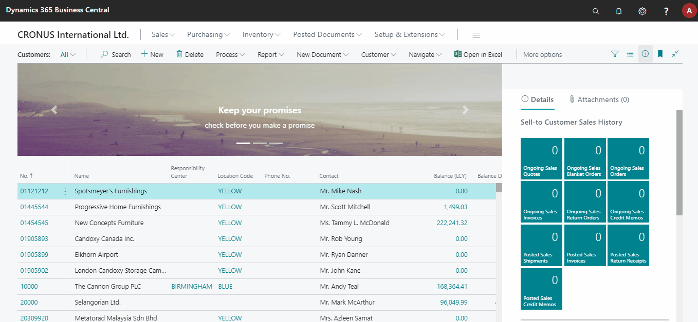

# Why to use create Control Add-ins - Overview with a simple Example

## About Control Add-ins

Control Add-in is a special type of object in Business Central to create user controls. In other words Control Add-in is a web component developed using JavaScript, HTML, CSS that can interact with Business Central. You need Control Add-in (Custom User Control) when you do not have such control available in standard Business Central page controls. Also you need Control Add-in when you want to simplify User Interface for your Business Central User.

## Skills Required

You need to know have the following skills to develop Control Add-ins:

	• AL - Good
	• HTML - Basic
	• CSS - Basic
	• JavaScript - Basic

If you are smart enough, you just need to know how to copy paste :)

If you are new to [HTML](https://www.w3schools.com/html/), [CSS](https://www.w3schools.com/css/), and [JavaScript](https://www.w3schools.com/js/) in my opinion [w3shools.com](https://www.w3schools.com/html/) is the best place to learn quickly.

## Dos and don'ts

You should try to create reusable Control Add-ins, you should void hard-coding, you should be able to use in more than one page.
For example 
	• A 'map control' can be used, in Customer, Vendor, Bank, Location pages. 
	• A 'status indicator control' can be used in Sales, Purchase, and Service Orders, may be in Back Reconciliation page also. 

If you hard-code slides data in Control Add-in instead of sending as parameter in the below example, you can not use this Control Add-in in other pages.

## No more talking - Let's create a Control Add-in

We don’t need to develop Control Add-in from the scratch. There are tons of open source web components available on the web. We just need to understand the component and convert it to Control Add-in.

We are creating [Carousel](https://getbootstrap.com/docs/4.5/components/carousel/#with-captions) control using [Bootstrap](https://getbootstrap.com/) component.

We need to use the following resources for any bootstrap component:

[CSS](https://getbootstrap.com/docs/4.5/getting-started/introduction/#css)
```html
<link rel="stylesheet" href="https://stackpath.bootstrapcdn.com/bootstrap/4.5.0/css/bootstrap.min.css" integrity="sha384-9aIt2nRpC12Uk9gS9baDl411NQApFmC26EwAOH8WgZl5MYYxFfc+NcPb1dKGj7Sk" crossorigin="anonymous">
```

[JS](https://getbootstrap.com/docs/4.5/getting-started/introduction/#js)
```html
<script src="https://code.jquery.com/jquery-3.5.1.slim.min.js" integrity="sha384-DfXdz2htPH0lsSSs5nCTpuj/zy4C+OGpamoFVy38MVBnE+IbbVYUew+OrCXaRkfj" crossorigin="anonymous"></script>
<script src="https://cdn.jsdelivr.net/npm/popper.js@1.16.0/dist/umd/popper.min.js" integrity="sha384-Q6E9RHvbIyZFJoft+2mJbHaEWldlvI9IOYy5n3zV9zzTtmI3UksdQRVvoxMfooAo" crossorigin="anonymous"></script>
<script src="https://stackpath.bootstrapcdn.com/bootstrap/4.5.0/js/bootstrap.min.js" integrity="sha384-OgVRvuATP1z7JjHLkuOU7Xw704+h835Lr+6QL9UvYjZE3Ipu6Tp75j7Bh/kR0JKI" crossorigin="anonymous"></script>
```

[HTML](https://getbootstrap.com/docs/4.5/components/carousel/#with-captions)
```html
<div id="carouselExampleCaptions" class="carousel slide" data-ride="carousel">
  <ol class="carousel-indicators">
    <li data-target="#carouselExampleCaptions" data-slide-to="0" class="active"></li>
    <li data-target="#carouselExampleCaptions" data-slide-to="1"></li>
    <li data-target="#carouselExampleCaptions" data-slide-to="2"></li>
  </ol>
  <div class="carousel-inner">
    <div class="carousel-item active">
      
      <div class="carousel-caption d-none d-md-block">
        <h5>First slide label</h5>
        <p>Nulla vitae elit libero, a pharetra augue mollis interdum.</p>
      </div>
    </div>
    <div class="carousel-item">
      
      <div class="carousel-caption d-none d-md-block">
        <h5>Second slide label</h5>
        <p>Lorem ipsum dolor sit amet, consectetur adipiscing elit.</p>
      </div>
    </div>
    <div class="carousel-item">
      
      <div class="carousel-caption d-none d-md-block">
        <h5>Third slide label</h5>
        <p>Praesent commodo cursus magna, vel scelerisque nisl consectetur.</p>
      </div>
    </div>
  </div>
  <a class="carousel-control-prev" href="#carouselExampleCaptions" role="button" data-slide="prev">
    <span class="carousel-control-prev-icon" aria-hidden="true"></span>
    <span class="sr-only">Previous</span>
  </a>
  <a class="carousel-control-next" href="#carouselExampleCaptions" role="button" data-slide="next">
    <span class="carousel-control-next-icon" aria-hidden="true"></span>
    <span class="sr-only">Next</span>
  </a>
</div>
```

### Control Add-in Object (CarouselControl.controladdin.al)
This 'Carousel Control' Control Add-in has OnStartup trigger, this will be triggered once the control is loaded. 
SetCarouselData is a function that will send carousel control data to Control Add-in. 

```
controladdin "Carousel Control"
{
    HorizontalStretch = true;
    RequestedHeight = 200;

    // JS files required for Bootstrap
    Scripts = 'https://code.jquery.com/jquery-3.5.1.slim.min.js',
        'https://cdn.jsdelivr.net/npm/popper.js@1.16.0/dist/umd/popper.min.js',
        'https://stackpath.bootstrapcdn.com/bootstrap/4.5.0/js/bootstrap.min.js';

    StartupScript = 'src/startup.js';

    // Bootstrap css
    StyleSheets = 'https://stackpath.bootstrapcdn.com/bootstrap/4.5.0/css/bootstrap.min.css';

    procedure SetCarouselData(Data: JsonObject);
    event OnStartup();
}
```

### Startup Javascript file (startup.js)
This javascript will be loaded once the User Control is ready. We are invoking 'OnStartup' trigger so that hosting page can receive and trigger event and send the data to the User Control.

```javascript
Microsoft.Dynamics.NAV.InvokeExtensibilityMethod('OnStartup')

function carouselIndicators(slides) {
    var indicators = [];
    for (var i = 0; i < slides.length; i++) {
        var cssClass = i === 0 ? 'class="active"' : '';
        indicators.push(`<li data-target="#carouselExampleCaptions" data-slide-to="${i}" ${cssClass}></li>`);
    }

    return `<ol class="carousel-indicators">${indicators.join('')}</ol>`;
}

function carouselItems(slides) {
    var carouselItems = [];
    for (var i = 0; i < slides.length; i++) {
        var slide = slides[i];
        var cssClass = i === 0 ? 'active' : '';

        carouselItems.push(`
<div class="carousel-item ${cssClass}">
    
        <div class="carousel-caption d-none d-md-block">
        <h5>${slide.title}</h5>
        <p>${slide.description}</p>
    </div>
</div>`);
    }

    return `<div class="carousel-inner">${carouselItems.join('')}</div>`;
}

function carouselMarkup(data) {
    return `
<div id="carouselExampleCaptions" class="carousel slide" data-ride="carousel">
    ${carouselIndicators(data.slides)}
    ${carouselItems(data.slides)}
    <a class="carousel-control-prev" href="#carouselExampleCaptions" role="button" data-slide="prev">
        <span class="carousel-control-prev-icon" aria-hidden="true"></span>
        <span class="sr-only">Previous</span>
    </a>
    <a class="carousel-control-next" href="#carouselExampleCaptions" role="button" data-slide="next">
        <span class="carousel-control-next-icon" aria-hidden="true"></span>
        <span class="sr-only">Next</span>
    </a>
</div>`;
}

window.SetCarouselData = function (data) {
    try {
        var markup = carouselMarkup(data);
        document.getElementById('controlAddIn').innerHTML = markup;
        $('#carouselExampleCaptions').carousel();
        console.log(markup);
    } catch (err) {
        console.log(err);
    }
}
```

### Page (CustomerListExt.PageExt.al)
We are extending Customers page to add 'Carousel Control' at the top of the customers list. 'OnStartup' event we are preparing Json object that contains slides data and sending it to Carousel control.

```
pageextension 50100 CustomerListExt extends "Customer List"
{
    layout
    {
        addbefore(Control1)
        {
            usercontrol(Carousel; "Carousel Control")
            {
                trigger OnStartup()
                var
                    JObject: JsonObject;
                    Slides: JsonArray;
                begin
                    Slides.Add(AddSlide('Keep your promises', 'check before you make a promise', '//unsplash.it/1024/200'));
                    Slides.Add(AddSlide('Never forget', 'always register your conversations to ensure you follow-up promptly', '//unsplash.it/1025/200'));
                    Slides.Add(AddSlide('Qualify', 'be picky about which opportunities to spend time on', '//unsplash.it/1024/201'));
                    JObject.Add('slides', Slides);
                    CurrPage.Carousel.SetCarouselData(JObject);
                end;
            }
        }
    }

    local procedure AddSlide(Title: Text; Description: Text; Image: Text): JsonObject
    var
        Slide: JsonObject;
    begin
        Slide.Add('title', Title);
        Slide.Add('description', Description);
        Slide.Add('image', Image);
        exit(Slide);
    end;
}
```

## Carousel Control in Action


## Conclusion

If we think about it, actually we don't need training to work on portals just because they are intuitive. But in the case of Business Applications we definitely need to provide training to the Business Users, where as they already know their business more than us. Is int it funny! It is simply because we are not providing proper intuitive User Interfaces. I think we should try to provide proper UI to our customers so that it is convenient for their Users. Proper UI means we should not restrict ourself to only to the available controls, where ever required we should definitely try to create Control Add-ins / User Controls for better user experience.

Use Control Add-ins - Help customers!!

You can download source code from [Github]()
